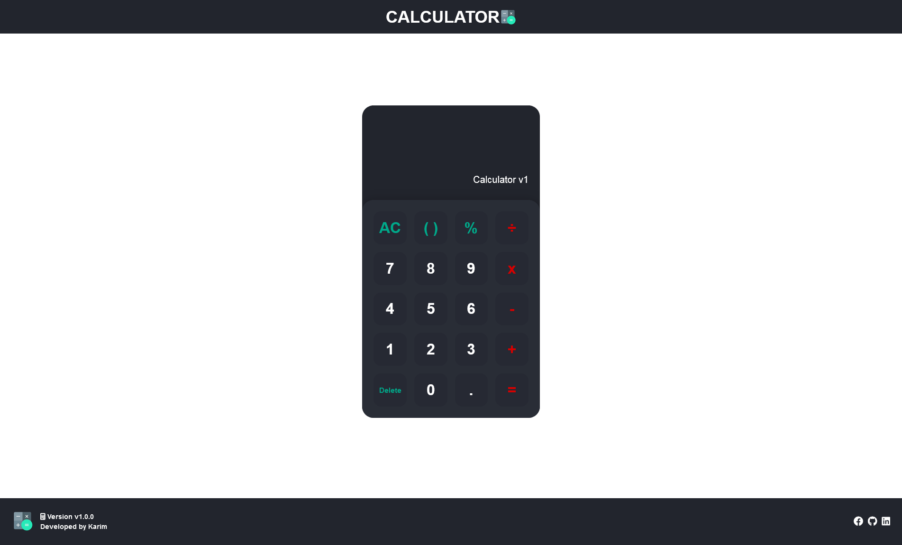

#CodSoft 
----
>Task 3 
---
## Creating a Calculator



----
>Using HTML , CSS , JavaScript

### Project Structure

The project should have the following structure:

```plaintext
/calculator
  ├── index.html
  ├── style.css
  └── js.js
